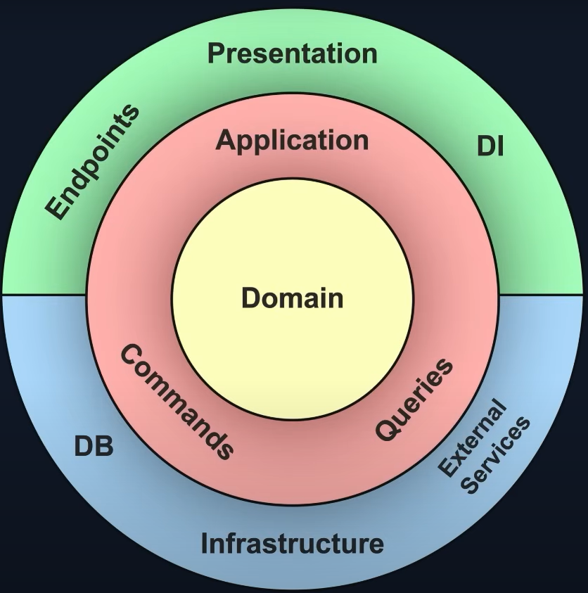

# CleanArchitectureDemo
This Project Is For My learning purposes to Create a Enterprise Application that utilizes a varation between the Clean Architecture Application Pattern and the Verticle Slice Application Pattern. Before revieweing these I want to research and define the common  enterprise application design patterns.With Each pattern I will define its pros and cons. I may come back and update this to also include there best use cases.

# Different Types of Application Architecture:
### 1. Monolithic Architecture (All-in-one)

*   **Description:**
    The most basic approach where all the code for an application exists within a single project and deployment unit. In the early stages, it's fast and simple, often starting with `File -> New Project` and expanding by adding new files. Over time, as features are added without strict boundaries, it can become difficult to maintain, often referred to as a "Big Ball of Mud."

*   **Key Characteristics:**
    *   Single, unified codebase and deployment artifact.
    *   Components are tightly coupled.
    *   Logical layers (UI, Business, Data) are often just folders within the single project.
    *   All data is typically stored in a single, shared database.

*   **Common Structure (Folder-Based Layers):**
    ```
    └── MyWebApp/
        ├── MyWebApp.csproj
        ├── Controllers/
        │   └── Controller.cs
        ├── Models/ (or ViewModels)
        │   └── ViewModel.cs
        ├── BusinessLogic/ (or Services)
        │   └── Service.cs
        ├── DataAccess/ (or Repositories)
        │   └── Repository.cs
        └── wwwroot/
    ```

*   **Pros:**
    *   **Simple to Start:** Very low initial complexity; fast to get up and running.
    *   **Easy to Develop & Debug:** All code is in one place, making it straightforward to trace execution flow.
    *   **High Performance:** In-process calls between components are extremely fast.

*   **Cons:**
    *   **Difficult to Maintain:** The codebase becomes tangled and hard to understand as it grows.
    *   **Hard to Scale:** You must scale the entire application, even if only one small part is a bottleneck.
    *   **Technology Lock-in:** Difficult to introduce new technologies or upgrade frameworks for parts of the app.
    *   **Low Fault Tolerance:** A bug or crash in one feature can bring down the entire application.

---

### 2. Layered Architecture (N-Tier)

*   **Description:**
    This pattern enforces a separation of concerns by splitting the code into distinct logical blocks, or "layers," which are typically different projects within a single solution. It promotes code reuse and makes the application easier to maintain because changes are localized to a specific layer. However, the layers remain coupled in a top-down fashion, and the application is still deployed as a single unit.

*   **Key Characteristics:**
    *   Code is organized into projects based on technical responsibility (e.g., UI, Business, Data).
    *   Strict dependency flow: A layer can only communicate with the layer directly beneath it.
    *   Promotes reuse of common functionalities, like data access logic.

*   **Common Structure (Project-Based Layers):**
    ```
    MyWebApp.sln
    ├── MyWebApp.Presentation/ (ASP.NET Core Project)
    │   └── Depends on -> MyWebApp.Business
    ├── MyWebApp.Business/ (Class Library)
    │   └── Depends on -> MyWebApp.DataAccess
    └── MyWebApp.DataAccess/ (Class Library)
        └── (No further dependencies)
    ```

*   **Pros:**
    *   **Good Separation of Concerns:** Easier to manage and for developers to specialize.
    *   **Improved Maintainability:** You can change the implementation of one layer (e.g., switch the database) with less impact on the others.
    *   **Promotes Reusability:** The Business and Data Access layers can be reused by other presentation layers (e.g., a desktop or mobile app).

*   **Cons:**
    *   **Tight Coupling Between Layers:** The Business layer is still directly dependent on the Data Access layer, making it hard to test business logic in isolation.
    *   **Monolithic Deployment:** Despite project separation, it's typically deployed as a single application, limiting scalability.
    *   **Can Add Unnecessary Complexity:** For simple applications, creating multiple projects can be overkill.

---

### 3. Clean Architecture (Onion/Hexagonal)

*   **Description:**
    An evolution of the Layered Architecture that solves the problem of coupling by inverting the dependencies. At its core is the **Dependency Rule**: source code dependencies can only point **inwards**. The inner layers (Domain/Business Rules) are completely independent of the outer layers (Infrastructure/UI). This is achieved by having inner layers define interfaces (abstractions) that outer layers implement.

*   **Key Characteristics:**
    *   **Domain-Centric:** The core business logic and entities are at the center, with no external dependencies.
    *   **Dependency Inversion:** Outer layers (Infrastructure) depend on inner layers (Application), not the other way around.
    *   **Independent of Frameworks & UI:** The core logic can exist and be tested without a database, web server, or UI.

*   **Common Structure (Inward-Pointing Dependencies):**
    ```
    MyWebApp.sln
    ├── Presentation/ (WebApi, UI)
    │   └── Depends on -> Application
    ├── Infrastructure/ (Database, Email, APIs)
    │   └── Depends on -> Application
    ├── Application/ (Use Cases, Interfaces)
    │   └── Depends on -> Domain
    └── Domain/ (Entities, Core Logic)
        └── (No dependencies)
    ```

*   **Pros:**
    *   **Highly Decoupled & Pluggable:** Easily swap databases, UI frameworks, or other external services.
    *   **Extremely Testable:** Business logic can be tested in complete isolation, leading to fast and reliable unit tests.
    *   **Highly Maintainable:** Changes to external details (like a database) have zero impact on the core domain logic.

*   **Cons:**
    *   **Higher Initial Complexity:** Requires more setup and boilerplate code.
    *   **Steeper Learning Curve:** Demands a good understanding of software design principles like SOLID.

---

### 4. Vertical Slice Architecture

*   **Description:**
    A pattern for organizing code that complements Clean Architecture. Instead of grouping files by their technical type (horizontal layers), it groups them by **feature** (vertical slices). All the code needed to implement a single feature—from the API endpoint to the data access logic—is located in the same folder. This maximizes cohesion and makes the codebase much easier to navigate and maintain.

*   **Key Characteristics:**
    *   **Organized by Feature:** Code is structured around business capabilities, not technical layers.
    *   **High Cohesion:** Code that changes together, lives together.
    *   **Low Coupling:** Slices should be as independent from each other as possible.
    *   Often used *within* the projects of a Clean Architecture solution.

*   **Common Structure (Feature-Based Folders):**
    ```
    MyWebApp.Application/
    └── Features/
        ├── Create/
        │   ├── CreateCommand.cs
        │   ├── CreateCommandHandler.cs
        │   └── CreateValidator.cs
        ├── GetById/
        │   ├── GetByIdQuery.cs
        │   └── GetByIdQueryHandler.cs
        └── Update/
            ├── UpdateCommand.cs
            └── UpdateCommandHandler.cs
    ```

*   **Pros:**
    *   **Easier to Find and Reason About Code:** All logic for a feature is in one place.
    *   **Improved Productivity:** Less jumping between files and folders to complete a task.
    *   **Reduces Code Conflicts:** Different developers working on different features are less likely to touch the same files.

*   **Cons:**
    *   **Potential for Code Duplication:** Can lead to small amounts of duplicated code between slices if not managed carefully with shared helpers.
    *   **Requires Discipline:** The team must be disciplined about keeping slices independent.

---

### 5. Microservices Architecture

*   **Description:**
    An architectural style that structures an application as a collection of small, autonomous services modeled around business domains. Each service is self-contained, independently deployable, and can be developed and scaled on its own. Services communicate with each other over a network using lightweight protocols like HTTP/REST or asynchronous messaging.

*   **Key Characteristics:**
    *   Application is decomposed into independent services.
    *   Each service has its own codebase, data store, and deployment pipeline.
    *   Services are organized around business capabilities (e.g., Users, Orders, Payments).
    *   Decentralized governance, allowing for different technology stacks per service.

*   **Common Structure (Multiple Independent Services):**
    ```
    Company.System/
    ├── Service/ (A complete, deployable app)
    │   ├── Service.sln
    │   └── ...
    ├── OrderService/ (A complete, deployable app)
    │   ├── OrderService.sln
    │   └── ...
    ├── PaymentService/ (A complete, deployable app)
    │   ├── PaymentService.sln
    │   └── ...
    └── ApiGateway/ (Entry point that routes requests)
    ```

*   **Pros:**
    *   **Independent Deployment & Scaling:** Update and scale services individually.
    *   **High Fault Tolerance:** Failure in one service doesn't take down the entire system.
    *   **Technology Flexibility:** Use the best language/framework for the job in each service.
    *   **Team Autonomy:** Small teams can own and operate their services independently.

*   **Cons:**
    *   **Massive Operational Complexity:** Requires expertise in DevOps, containerization (Docker, Kubernetes), and monitoring distributed systems.
    *   **Network Latency & Reliability:** Communication over the network is slower and less reliable than in-process calls.
    *   **Data Consistency:** Maintaining data consistency across services is a major challenge.

---

### 6. Event-Driven Architecture (EDA)

*   **Description:**
    A pattern built around the production, detection, consumption of, and reaction to **events**. Components are highly decoupled and communicate asynchronously. Instead of one service directly calling another, it publishes an event (e.g., `OrderPlaced`). Other services can subscribe to this event and react accordingly without the original service knowing who they are.

*   **Key Characteristics:**
    *   Asynchronous, non-blocking communication.
    *   Components are decoupled in time and space.
    *   Relies on an **Event Bus** or **Message Broker** (e.g., RabbitMQ, Kafka) to route events.
    *   Components act as **Producers** (publishing events) and **Consumers** (subscribing to events).

*   **Common Structure (Logical Flow, not Project Structure):**
    ```
    [Order Service]          (produces event)
           |
           v
    --[ OrderPlaced Event ]--> [ Event Bus / Broker ] --[ OrderPlaced Event ]--> [Notification Service] (consumes event)
                                      |
                                      `--[ OrderPlaced Event ]--> [Inventory Service]  (consumes event)
    ```

*   **Pros:**
    *   **Extreme Decoupling:** Producers and consumers have no knowledge of each other.
    *   **High Scalability & Resilience:** Services can fail and recover without data loss; easily add more consumers to handle load.
    *   **Real-time Responsiveness:** Enables systems to react to changes as they happen.

*   **Cons:**
    *   **Difficult to Debug:** Tracing a business process that spans multiple asynchronous events is complex.
    *   **Eventual Consistency:** Data consistency is not guaranteed in real-time, which can be a challenge for some business requirements.
    *   **Complexity of Broker:** Requires managing and maintaining a message broker infrastructure.
    1. Monolithic (All-in-one architecture)
        - All the code for the application lives or is contained in a single project and in the case for Enterprise applications is typically one large Visual Studio project
        - Layers are typically folders in this case
        - Can be difficult to maintain
        - described as a scenario where File -> New project where it is fast and easy to simply expand the features for this project by adding a new file but over time results in this behavior
    2. Layered architecture (N-teir architecture)
        - Enforce splitting up the code in different blocks which typically looks like different projects in the solution
        - Promotes reuse - for example i we implemenet logic for data acceses layer and all the business logic can use it in the assocaited layer
        - Easier to mainaint if we need to change it behavior we can update that layer or rather in a single location
        - Pluggable - easier plugability assume we need to switch database for this project the handling will be assocaited with the data acceses layer
        - Disadvantages of layered is still coupling between layers
        - Behaves as a single application that makes it hard to split up across multiple servers and is recommended that if you want o scale this type of apllication architecture you will need to go the microservices route
    3. Clean Architecure (onion/hexagonal architecure)

    4.Event Driven Architecure
    5.Microservice Architecture

This is a Rest API with Swagger



Lets start by reviewing the core Design principiples we aim to encapsulate in this project:
Important Design Principles:
 - Dependency inversion
 - Seperation of concerns
 - Single responsibility
 - DRY (Dont Repeat Yourself)
 - Persistence ignorance

Dependency inversion:
 - Decoupling modules
 We will implement interfaces that act as abstractions so that the dependencies point to the abstractions(interfaces)
  - typically point top to bottom
  Helps with building more loosely-coupled applications that are more maintainable long term
  Dependencies should be pointing to abstractions(interfaces) not to details
  This works because at runtime the concret implementation aka the class that implements the interface abstraction will be used in the case where we are calling the interface

Seperation of Concerns:
 - Split logic components into blocks of functionality
    - Each covering a concern - each block should be on job
 - More modular code each module will do one single task and encapsulate all logic for that single task
    - Encapsulation within a module

Single Responsibility:
  - object oriented coding terminilogy which states that a class should have one single responsibility
     - Each block should just have one single responsibilty which it encapsulates
  - More new classes are added as the solution grows for the assocaited feature responsibility as to not break existing functionality
     - This will be extended and applied in the application-level/layer within the Clean Architecture
        - Different Layers have their own responsibility. Each layer should be in charge of one functionality of the system.

DRY (Dont Repeat Yourself):
  - Less code repition - attempt to avoid duplicate code so it is easier to change

Persistence Ignorance:
  - POCO
     - Domain classes shouldnt be impacted by how they are persisted
  - Typically requires base classes or attributes
     - This allows more freedom to easly change the data persistance technologies more readaily like going from EF core to Nhibernate or if we are wanting to implement caching 


Patterns to be implemented:
 - Repository pattern
 - Units of work patterb
 - CQRS (Command Query Responsibility )
 - Mediator pattern
The Domain Layer:

The Application Layer:

The Infrastructure Layer:

The Presentation Layer: